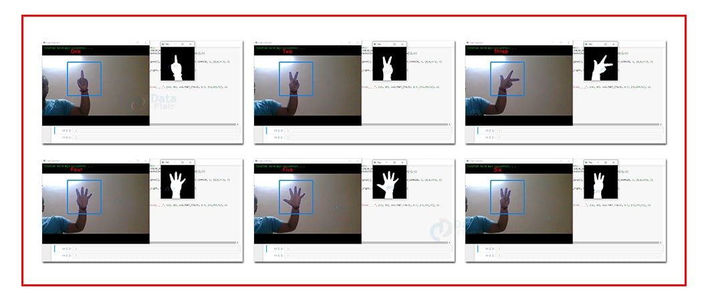

# Signlanguage-Recognition

This project is a real-time sign language recognition system using a Convolutional Neural Network (CNN) built with TensorFlow/Keras and OpenCV for webcam input. It can classify hand gestures from A to Z and display the predicted letter on the webcam feed.

##  Features

- Real-time webcam input using OpenCV
- CNN-based model trained on sign language alphabet dataset
- Live prediction of hand signs (A–Z)
- Overlay of predicted letter on video feed

## Output

